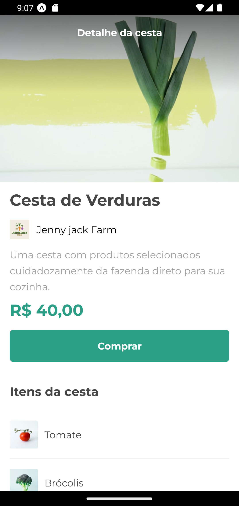
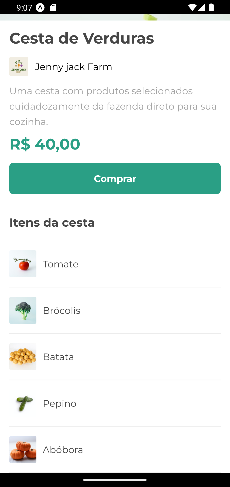

<h1 align="center">Orgs React Native</h1>

  
  
  

 • <a href="#-sobre">Sobre</a> •
 <a href="#-como-rodar">Como rodar</a> •
 <a href="#-autor">Autor</a> 

<h2>📌 Sobre</h2>

Projeto do curso de React Native da Alura, que implementa uma tela de detalhes de um carrinho de compras. São exibidos dados (estáticos) como nome da cesta + itens, nome da loja e preço.

 
 

<h2>🕹 Como Rodar</h2>

💻 Para rodar localmente será necessário ter instalado o NodeJS + NPM, a versã Node usada para o desenvolvimento foi a 16.16.0.
<ul> 
<li> No terminal clone o projeto (<code>git clone https://github.com/oisol/orgs-react-native.git</code>)
<li> <code>cd orgs-react-native</code>
<li> Será necessario ter a CLI do expo: <code>npm install --global expo-cli</code>
<li> <code>npm install</code>
<li> <code>npm start</code>
<li> inicie via Expo Go no seu celular ou emulador
</ul>

<h2>👩‍💻 Autor</h2>

Feito por Matheus Rocha.

🔎 <a href="https://www.linkedin.com/in/matheus-rocha-dev">Linkedin</a>

📧 <a href="mailto:matheusrocha.dev01@gmail.com">Email: matheusrocha.dev01@gmail.com</a>

